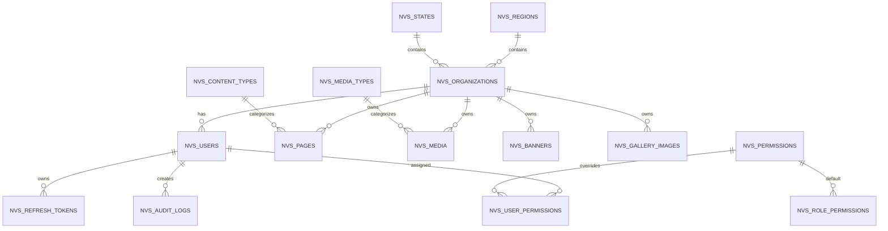

# Production-Ready NVS CMS Backend
## Database Design Specification

Version: 1.0

---

# 1. Purpose

This document defines the complete database architecture for the NVS CMS Backend.

It is the single source of truth for

- PostgreSQL schema
- Prisma schema
- Relationships
- Constraints
- Indexes
- Enums
- Naming conventions
- Seed strategy

Every implementation must follow this document.

No database changes should be made without updating this specification.

---

# 2. Database Philosophy

The database is the foundation of the application.

Application architecture, APIs and business logic are built on top of the data model.

Design priorities

- Data Integrity
- Consistency
- Maintainability
- Performance
- Simplicity
- Scalability

Avoid unnecessary normalization while preventing data duplication.

---

# 3. Database Engine

Database

```
PostgreSQL
```

ORM

```
Prisma ORM
```

No other ORM should be introduced.

---

# 4. Naming Conventions

## Tables

Every table must

- use snake_case
- use plural names
- start with `nvs_`

Examples

```
nvs_users

nvs_pages

nvs_media

nvs_content_types
```

---

## Columns

All columns

```
snake_case
```

Examples

```
organization_id

created_at

deleted_at

created_by
```

---

## Primary Keys

Every table must contain

```
id
```

Rules

- Integer
- Auto Increment
- Primary Key

Never use UUID.

---

## Foreign Keys

Always use

```
table_name_id
```

Examples

```
organization_id

role_id

permission_id

media_type_id
```

---

## Timestamp Columns

Transactional tables must contain

```
created_at

updated_at
```

---

## Audit Columns

Transactional tables must contain

```
created_by

updated_by
```

---

## Soft Delete Columns

Transactional tables must contain

```
is_deleted

deleted_at

deleted_by
```

---

# 5. Standard Table Structure

Every transactional table should follow a consistent structure.

Example

```
id

...

created_at

updated_at

created_by

updated_by

is_deleted

deleted_at

deleted_by
```

Reference tables may omit Soft Delete if appropriate.

---

# 6. Prisma Conventions

Prisma model names

```
PascalCase
```

Examples

```
User

Organization

Media

Page
```

Table mapping

```
@@map("nvs_users")
```

Field mapping

```
@map("created_at")
```

Always use explicit mappings where required.

---

# 7. Required Prisma Enums

Only fixed values should be represented as enums.

---

## Role

```
SUPER_ADMIN

HEADQUARTER

NLI

REGIONAL

JNV
```

---

## OrganizationType

```
HEADQUARTER

NLI

REGIONAL_OFFICE

JNV
```

---

## PageStatus

```
DRAFT

PUBLISHED
```

---

## UserStatus

```
ACTIVE

INACTIVE

LOCKED
```

---

# 8. Relationships

The hierarchy is

```
Region

↓

Regional Office

↓

JNV

↓

Users

↓

Pages

↓

Media
```

Permissions

```
Role

↓

Permissions

↓

User Permission Overrides
```

Audit Logs reference

```
Users
```

---

# 9. Soft Delete Strategy

Transactional entities

- Users
- Organizations
- Pages
- Media
- Regions
- States
- Content Types
- Media Types

shall support Soft Delete.

Implementation

```
is_deleted

deleted_at

deleted_by
```

Queries should automatically exclude deleted records.

---

# 10. Audit Strategy

Every transactional entity should maintain

```
created_by

updated_by

deleted_by
```

Business operations should additionally create records in

```
nvs_audit_logs
```

Audit history must never be modified.

---

# 11. Unique Constraints

The following values must be unique.

Users

```
email
```

Organizations

```
organization_code
```

Permissions

```
permission_key
```

Content Types

```
name
```

Media Types

```
name
```

Regions

```
region_code
```

States

```
state_code
```

---

# 12. Recommended Indexes

Create indexes on

```
organization_id

role

created_at

updated_at

is_deleted

content_type_id

media_type_id

status
```

Foreign keys should always be indexed.

---

# 13. Seed Strategy

Seed scripts must be idempotent.

Running

```
npm run seed
```

multiple times should never create duplicate data.

Prefer

```
upsert()
```

over create() whenever possible.

---

# 14. Migration Strategy

Every schema modification must create a Prisma migration.

Migration names should describe the change.

Examples

```
create_users

create_pages

add_permissions

add_refresh_tokens
```

Never modify existing migrations.

Always create a new migration.

---

# 15. Database Design Principles

The following principles are mandatory.

- Normalize reusable reference data.
- Use enums for fixed values.
- Use master tables for configurable values.
- Avoid duplicate data.
- Prefer foreign keys over text references.
- Preserve referential integrity.
- Design for future expansion.
- Keep the schema simple and maintainable.

---

# 16. Database Tables

This section defines every table required by the application.

The schema is designed to:

- Minimize duplication
- Maintain referential integrity
- Support future growth
- Keep the design simple
- Follow PostgreSQL and Prisma best practices

---

# 16.1 nvs_regions

## Purpose

Stores Regional Office regions.

Each Regional Office belongs to exactly one Region.

---

### Columns

| Column | Type | Constraints |
|----------|--------|----------------|
| id | SERIAL | PK |
| region_name | VARCHAR(150) | UNIQUE, NOT NULL |
| region_code | VARCHAR(20) | UNIQUE, NOT NULL |
| created_at | TIMESTAMP | NOT NULL |
| updated_at | TIMESTAMP | NOT NULL |
| created_by | INTEGER | FK → nvs_users.id |
| updated_by | INTEGER | FK → nvs_users.id |
| is_deleted | BOOLEAN | DEFAULT FALSE |
| deleted_at | TIMESTAMP | NULL |
| deleted_by | INTEGER | FK → nvs_users.id |

---

### Relationships

```
Region

↓

Regional Offices
```

---

### Indexes

```
region_code

is_deleted
```

---

# 16.2 nvs_states

## Purpose

Stores Indian States and Union Territories.

Each JNV belongs to one State.

---

### Columns

| Column | Type | Constraints |
|----------|--------|----------------|
| id | SERIAL | PK |
| state_name | VARCHAR(150) | UNIQUE |
| state_code | VARCHAR(20) | UNIQUE |
| created_at | TIMESTAMP | NOT NULL |
| updated_at | TIMESTAMP | NOT NULL |
| created_by | INTEGER | FK |
| updated_by | INTEGER | FK |
| is_deleted | BOOLEAN | DEFAULT FALSE |
| deleted_at | TIMESTAMP | NULL |
| deleted_by | INTEGER | FK |

---

### Relationships

```
State

↓

JNV Organizations
```

---

### Indexes

```
state_code

is_deleted
```

---

# 16.3 nvs_organizations

## Purpose

Represents every organizational unit.

Supports

- Headquarters
- NLI
- Regional Office
- JNV

---

### Columns

| Column | Type | Constraints |
|----------|--------|----------------|
| id | SERIAL | PK |
| organization_name | VARCHAR(255) | NOT NULL |
| organization_code | VARCHAR(30) | UNIQUE |
| organization_type | ENUM | NOT NULL |
| parent_organization_id | INTEGER | FK → nvs_organizations.id |
| region_id | INTEGER | FK → nvs_regions.id |
| state_id | INTEGER | FK → nvs_states.id |
| address | TEXT | NULL |
| created_at | TIMESTAMP | NOT NULL |
| updated_at | TIMESTAMP | NOT NULL |
| created_by | INTEGER | FK |
| updated_by | INTEGER | FK |
| is_deleted | BOOLEAN | DEFAULT FALSE |
| deleted_at | TIMESTAMP | NULL |
| deleted_by | INTEGER | FK |

---

### Relationships

```
Headquarters

↓

Regional Offices

↓

JNV
```

NLI has no parent organization.

---

### Business Rules

Regional Office

```
parent = Headquarters
```

JNV

```
parent = Regional Office
```

NLI

```
No parent
```

---

### Indexes

```
organization_code

organization_type

parent_organization_id

region_id

state_id

is_deleted
```

---

# 16.4 nvs_users

## Purpose

Stores authenticated system users.

---

### Columns

| Column | Type | Constraints |
|----------|--------|----------------|
| id | SERIAL | PK |
| name | VARCHAR(150) | NOT NULL |
| email | VARCHAR(255) | UNIQUE |
| password | VARCHAR(255) | NOT NULL |
| mobile | VARCHAR(20) | NULL |
| address | TEXT | NULL |
| role | ENUM(Role) | NOT NULL |
| organization_id | INTEGER | FK |
| status | ENUM(UserStatus) | NOT NULL |
| failed_login_attempts | INTEGER | DEFAULT 0 |
| locked_until | TIMESTAMP | NULL |
| last_login_at | TIMESTAMP | NULL |
| created_at | TIMESTAMP | NOT NULL |
| updated_at | TIMESTAMP | NOT NULL |
| created_by | INTEGER | FK |
| updated_by | INTEGER | FK |
| is_deleted | BOOLEAN | DEFAULT FALSE |
| deleted_at | TIMESTAMP | NULL |
| deleted_by | INTEGER | FK |

---

### Relationships

```
Organization

↓

Users

↓

Pages

↓

Media
```

---

### Indexes

```
email

organization_id

role

status

is_deleted
```

---

# 16.5 nvs_refresh_tokens

## Purpose

Stores active Refresh Tokens.

---

### Columns

| Column | Type | Constraints |
|----------|--------|----------------|
| id | SERIAL | PK |
| user_id | INTEGER | FK |
| refresh_token | VARCHAR(500) | NOT NULL (hashed preferred) |
| expires_at | TIMESTAMP | NOT NULL |
| revoked_at | TIMESTAMP | NULL |
| created_at | TIMESTAMP | NOT NULL |

---

### Relationships

```
User

↓

Refresh Tokens
```

---

### Indexes

```
user_id

expires_at
```

---

# 16.6 nvs_content_types

## Purpose

Master table for Page categories.

---

### Examples

```
About

Mission

Vision

Notice

Announcement

Welcome Message
```

---

### Columns

| Column | Type | Constraints |
|----------|--------|----------------|
| id | SERIAL | PK |
| name | VARCHAR(150) | UNIQUE |
| description | TEXT | NULL |
| display_order | INTEGER | DEFAULT 0 |
| created_at | TIMESTAMP | NOT NULL |
| updated_at | TIMESTAMP | NOT NULL |
| created_by | INTEGER | FK |
| updated_by | INTEGER | FK |
| is_deleted | BOOLEAN | DEFAULT FALSE |
| deleted_at | TIMESTAMP | NULL |
| deleted_by | INTEGER | FK |

---

### Indexes

```
name

display_order

is_deleted
```

---

# 16.7 nvs_media_types

## Purpose

Master table for uploaded document classifications.

---

### Examples

```
Notice

Circular

Tender

Office Memorandum

Manual

Policy

Report

Guideline
```

---

### Columns

| Column | Type | Constraints |
|----------|--------|----------------|
| id | SERIAL | PK |
| name | VARCHAR(150) | UNIQUE |
| description | TEXT | NULL |
| display_order | INTEGER | DEFAULT 0 |
| created_at | TIMESTAMP | NOT NULL |
| updated_at | TIMESTAMP | NOT NULL |
| created_by | INTEGER | FK |
| updated_by | INTEGER | FK |
| is_deleted | BOOLEAN | DEFAULT FALSE |
| deleted_at | TIMESTAMP | NULL |
| deleted_by | INTEGER | FK |

---

### Indexes

```
name

display_order

is_deleted
```

---

# 16.8 nvs_pages

## Purpose

Stores CMS page content.

Each page belongs to exactly one Organization and one Content Type.

Each organization may have only one page for a given Content Type.

---

### Columns

| Column | Type | Constraints |
|---------|------|-------------|
| id | SERIAL | PK |
| organization_id | INTEGER | FK → nvs_organizations.id |
| content_type_id | INTEGER | FK → nvs_content_types.id |
| title | VARCHAR(255) | NOT NULL |
| slug | VARCHAR(255) | UNIQUE |
| short_description | TEXT | NULL |
| content | TEXT | NOT NULL |
| status | ENUM(PageStatus) | DEFAULT DRAFT |
| display_order | INTEGER | DEFAULT 0 |
| published_at | TIMESTAMP | NULL |
| created_at | TIMESTAMP | NOT NULL |
| updated_at | TIMESTAMP | NOT NULL |
| created_by | INTEGER | FK → nvs_users.id |
| updated_by | INTEGER | FK → nvs_users.id |
| is_deleted | BOOLEAN | DEFAULT FALSE |
| deleted_at | TIMESTAMP | NULL |
| deleted_by | INTEGER | FK → nvs_users.id |

---

### Relationships

```
Organization

↓

Pages

↓

Content Type
```

---

### Business Rules

Each organization can have only one page per Content Type.

---

### Composite Unique Constraint

```
organization_id

+

content_type_id
```

---

### Indexes

```
organization_id

content_type_id

status

display_order

is_deleted
```

---

# 16.9 nvs_media

## Purpose

Stores uploaded document metadata.

Physical files remain on disk.

---

### Columns

| Column | Type | Constraints |
|---------|------|-------------|
| id | SERIAL | PK |
| organization_id | INTEGER | FK |
| media_type_id | INTEGER | FK |
| title | VARCHAR(255) | NOT NULL |
| description | TEXT | NULL |
| original_filename | VARCHAR(255) | NOT NULL |
| stored_filename | VARCHAR(255) | UNIQUE |
| file_path | VARCHAR(500) | NOT NULL |
| mime_type | VARCHAR(100) | NOT NULL |
| extension | VARCHAR(20) | NOT NULL |
| file_size | BIGINT | NOT NULL |
| checksum | VARCHAR(255) | NULL |
| uploaded_at | TIMESTAMP | NOT NULL |
| created_at | TIMESTAMP | NOT NULL |
| updated_at | TIMESTAMP | NOT NULL |
| created_by | INTEGER | FK |
| updated_by | INTEGER | FK |
| is_deleted | BOOLEAN | DEFAULT FALSE |
| deleted_at | TIMESTAMP | NULL |
| deleted_by | INTEGER | FK |

---

### Relationships

```
Organization

↓

Media

↓

Media Type
```

---

### Indexes

```
organization_id

media_type_id

mime_type

created_at

is_deleted
```

---

# 16.10 nvs_banners

## Purpose

Stores organization-owned banner image metadata. Physical image files remain on
local disk and are never stored in PostgreSQL.

### Columns

| Column | Type | Constraints |
|---------|------|-------------|
| id | SERIAL | PK |
| organization_id | INTEGER | FK → nvs_organizations.id, NOT NULL |
| title | VARCHAR(255) | NOT NULL |
| description | TEXT | NULL |
| alt_text | VARCHAR(255) | NULL |
| stored_filename | VARCHAR(255) | UNIQUE, NOT NULL |
| image_path | VARCHAR(500) | NOT NULL |
| mime_type | VARCHAR(100) | NOT NULL |
| extension | VARCHAR(20) | NOT NULL |
| file_size | BIGINT | NOT NULL |
| display_order | INTEGER | DEFAULT 0 |
| is_active | BOOLEAN | DEFAULT TRUE |
| start_date | TIMESTAMP | NULL |
| end_date | TIMESTAMP | NULL |
| created_at | TIMESTAMP | NOT NULL |
| updated_at | TIMESTAMP | NOT NULL |
| created_by | INTEGER | FK → nvs_users.id |
| updated_by | INTEGER | FK → nvs_users.id |
| is_deleted | BOOLEAN | DEFAULT FALSE |
| deleted_at | TIMESTAMP | NULL |
| deleted_by | INTEGER | FK → nvs_users.id |

### Business Rules

- Each banner belongs to exactly one organization.
- `end_date` must not precede `start_date`.
- Public consumers receive only active, non-deleted banners in their display window.
- Banner images are stored under the configured local banner upload directory.

### Indexes

```
organization_id

is_active

display_order

organization_id, is_active, display_order

is_deleted
```

---

# 16.11 nvs_gallery_images

## Purpose

Stores organization-owned gallery image metadata. Physical image files remain on
local disk and are never stored in PostgreSQL. Albums are intentionally omitted
because the current CMS has no shared category architecture for image assets.

### Columns

| Column | Type | Constraints |
|---------|------|-------------|
| id | SERIAL | PK |
| organization_id | INTEGER | FK → nvs_organizations.id, NOT NULL |
| title | VARCHAR(255) | NOT NULL |
| description | TEXT | NULL |
| alt_text | VARCHAR(255) | NULL |
| stored_filename | VARCHAR(255) | UNIQUE, NOT NULL |
| image_path | VARCHAR(500) | NOT NULL |
| mime_type | VARCHAR(100) | NOT NULL |
| extension | VARCHAR(20) | NOT NULL |
| file_size | BIGINT | NOT NULL |
| display_order | INTEGER | DEFAULT 0 |
| is_active | BOOLEAN | DEFAULT TRUE |
| created_at | TIMESTAMP | NOT NULL |
| updated_at | TIMESTAMP | NOT NULL |
| created_by | INTEGER | FK → nvs_users.id |
| updated_by | INTEGER | FK → nvs_users.id |
| is_deleted | BOOLEAN | DEFAULT FALSE |
| deleted_at | TIMESTAMP | NULL |
| deleted_by | INTEGER | FK → nvs_users.id |

### Business Rules

- Each image belongs to exactly one organization and is never assigned from client input.
- Management reads and mutations are restricted to the authenticated user's organization, except for SUPER_ADMIN.
- Public consumers receive only active, non-deleted images ordered by `display_order ASC`, then `created_at DESC`.
- Gallery images are stored under the configured local gallery upload directory.

### Indexes

```
organization_id

is_active

display_order

organization_id, is_active, display_order

is_deleted
```

---

# 16.12 nvs_permissions

## Purpose

Master table containing all application permissions.

Permission definitions are immutable.

Only seeded values are allowed.

---

### Columns

| Column | Type | Constraints |
|---------|------|-------------|
| id | SERIAL | PK |
| permission_key | VARCHAR(150) | UNIQUE |
| module | VARCHAR(100) | NOT NULL |
| action | VARCHAR(100) | NOT NULL |
| description | TEXT | NULL |
| created_at | TIMESTAMP | NOT NULL |

---

### Examples

```
USER_CREATE

USER_UPDATE

USER_DELETE

PAGE_CREATE

PAGE_UPDATE

PAGE_DELETE

MEDIA_UPLOAD

MEDIA_DELETE

AUDIT_LOG_VIEW
```

---

### Business Rules

- Seed only.
- No Create API.
- No Update API.
- No Delete API.

---

### Indexes

```
permission_key

module
```

---

# 16.12 nvs_role_permissions

## Purpose

Assigns default permissions to Roles.

This table defines the application's authorization baseline.

---

### Columns

| Column | Type | Constraints |
|---------|------|-------------|
| id | SERIAL | PK |
| role | ENUM(Role) | NOT NULL |
| permission_id | INTEGER | FK → nvs_permissions.id |
| created_at | TIMESTAMP | NOT NULL |

---

### Composite Unique Constraint

```
role

+

permission_id
```

---

### Relationships

```
Role

↓

Role Permissions

↓

Permissions
```

---

### Business Rules

Seed once.

Only modified through database seed updates.

---

### Indexes

```
role

permission_id
```

---

# 16.13 nvs_user_permissions

## Purpose

Stores permission overrides for individual users.

Overrides default Role permissions.

---

### Columns

| Column | Type | Constraints |
|---------|------|-------------|
| id | SERIAL | PK |
| user_id | INTEGER | FK → nvs_users.id |
| permission_id | INTEGER | FK → nvs_permissions.id |
| allowed | BOOLEAN | NOT NULL |
| created_at | TIMESTAMP | NOT NULL |
| created_by | INTEGER | FK → nvs_users.id |

---

### Relationships

```
User

↓

User Permission

↓

Permission
```

---

### Business Rules

User permissions always override Role permissions.

---

### Composite Unique Constraint

```
user_id

+

permission_id
```

---

### Indexes

```
user_id

permission_id
```

---

# 16.14 nvs_audit_logs

## Purpose

Stores immutable audit records for significant business events.

Audit Logs are append-only.

---

### Columns

| Column | Type | Constraints |
|---------|------|-------------|
| id | SERIAL | PK |
| user_id | INTEGER | FK → nvs_users.id |
| module | VARCHAR(100) | NOT NULL |
| entity | VARCHAR(100) | NOT NULL |
| entity_id | INTEGER | NULL |
| action | VARCHAR(100) | NOT NULL |
| previous_values | JSONB | NULL |
| new_values | JSONB | NULL |
| ip_address | VARCHAR(100) | NULL |
| user_agent | TEXT | NULL |
| created_at | TIMESTAMP | NOT NULL |

---

### Relationships

```
User

↓

Audit Logs
```

---

### Business Rules

Audit Logs are immutable.

Supported actions include

- Login
- Logout
- Create
- Update
- Delete
- Restore
- Permission Assignment
- Upload
- Download (optional)
- Publish

---

### Indexes

```
user_id

module

entity

entity_id

action

created_at
```

---

# 17. Authorization Model

Authorization follows this hierarchy.

```
User

↓

Role

↓

Role Permissions

↓

User Permission Overrides

↓

Final Effective Permissions
```

Permission evaluation order

```
Authenticate

↓

Load User

↓

Load Role

↓

Load Role Permissions

↓

Load User Permission Overrides

↓

Merge

↓

Authorize Request
```

---

# 18. Database Integrity Rules

The database must enforce:

- Foreign key constraints.
- Composite unique constraints.
- Referential integrity.
- NOT NULL constraints where applicable.
- Appropriate indexes on foreign keys.
- Soft Delete consistency.

Application logic must never rely solely on client-side validation.

---

# 19. Entity Relationship Diagram (ERD)

The following diagram represents the logical database relationships.



---

# 20. Authorization Model

Authorization follows the hierarchy below.

```
User

↓

Role (Enum)

↓

Role Permissions

↓

User Permission Overrides

↓

Effective Permissions

↓

API Access
```

Permission evaluation sequence

```
Authenticate User

↓

Load Role

↓

Load Role Permissions

↓

Load User Permission Overrides

↓

Merge Permissions

↓

Authorize Request
```

User Permission overrides always take precedence over Role Permissions.

---

# 21. Prisma Mapping Strategy

Every Prisma model should explicitly map to the PostgreSQL table.

Example

```prisma
model User {

  id Int @id @default(autoincrement())

  ...

  @@map("nvs_users")
}
```

Database column mappings should be used where naming differs.

Example

```prisma
createdAt DateTime @map("created_at")
```

---

# 22. Relationship Strategy

Always define explicit Prisma relationships.

Example

```prisma
organization Organization @relation(fields: [organizationId], references: [id])

organizationId Int
```

Avoid implicit relationships.

Always define both sides of a relationship.

---

# 23. Cascade Rules

Prefer **Restrict** or **SetNull** over **Cascade** for most business entities.

Recommended behavior

| Relationship | On Delete |
|--------------|-----------|
| Region → Organization | Restrict |
| State → Organization | Restrict |
| Organization → User | Restrict |
| Organization → Page | Restrict |
| Organization → Media | Restrict |
| User → Refresh Token | Cascade |
| User → Audit Log | Restrict |
| Permission → User Permission | Restrict |

Business records should not disappear automatically.

---

# 24. Seed Strategy

Database seeding must be deterministic.

Running the seed script multiple times should never create duplicate records.

Use Prisma `upsert()` wherever possible.

The seed process should populate:

## Regions

Official Regional Office regions.

---

## States

All Indian States and Union Territories.

---

## Organizations

- Headquarters
- 7 NLIs
- 10 Regional Offices
- JNVs (full dataset if available, otherwise representative sample)

---

## Users

At minimum

- One Super Admin

Additional sample users

- Headquarters User
- NLI User
- Regional User
- JNV User

---

## Content Types

Seed default values such as

- About
- Mission
- Vision
- Objectives
- Welcome Message
- Notice
- Announcement

---

## Media Types

Seed default values such as

- Notice
- Circular
- Tender
- Office Memorandum
- Notification
- Manual
- Report
- Guideline
- Policy
- Office Order
- Recruitment
- Training Material
- Form
- Other

---

## Permissions

Seed every application permission.

Permission definitions are immutable.

---

## Role Permissions

Assign default permissions for every Role.

Example

SUPER_ADMIN

- All permissions

HEADQUARTER

- Page Management
- Media Upload

NLI

- Page Management
- Media Upload

REGIONAL

- Page Management
- Media Upload

JNV

- Page Management
- Media Upload

---

# 25. Migration Strategy

Every schema change must create a new Prisma migration.

Migration names should clearly describe the purpose.

Examples

```
create_users

create_pages

create_permissions

create_media

add_refresh_tokens

add_soft_delete

create_audit_logs
```

Never modify an existing migration after it has been committed.

Always create a new migration.

---

# 26. Future Extensibility

The database has been designed to support future enhancements without major redesign.

Possible future additions include

- Categories
- Tags
- Image Gallery
- Video Library
- Workflow Approval
- Version History
- Scheduled Publishing
- Notifications
- Search
- Cloud Storage
- Digital Signatures
- API Keys
- External Integrations

These features should integrate through new tables rather than modifying existing core tables.

---

# 27. Database Review Checklist

Before approving any database change, verify the following.

## Design

- Uses `nvs_` table prefix.
- Uses integer auto-increment primary keys.
- Uses explicit foreign keys.
- Uses enums for fixed values.
- Uses master tables for configurable values.

---

## Integrity

- Foreign keys validated.
- Unique constraints defined.
- Composite unique constraints defined.
- Appropriate indexes created.

---

## Performance

- Foreign keys indexed.
- Frequently queried columns indexed.
- Pagination supported.
- No unnecessary duplication.

---

## Security

- Passwords hashed.
- Refresh Tokens protected.
- Sensitive information excluded.
- Audit trail preserved.

---

## Maintainability

- Naming conventions followed.
- Relationships documented.
- Seed strategy updated.
- Migrations created.

---

# 28. Final Database Principles

The database is the foundation of the application.

Every implementation must follow these principles.

- Database-first development.
- Data integrity over convenience.
- Simplicity over unnecessary normalization.
- Explicit relationships over implicit behavior.
- Enums for fixed values.
- Master tables for configurable values.
- Soft Delete for transactional entities.
- Immutable Audit Logs.
- Immutable Permission definitions.
- Role-based defaults with User Permission overrides.
- Deterministic seed scripts.
- Backward-compatible migrations.

No implementation should violate these principles.

---

# End of Document

This document is the authoritative database specification for the project.

It should be used together with:

- `docs/01_PROJECT_SPECIFICATION.md`
- `docs/02_IMPLEMENTATION_GUIDELINES.md`
- `docs/03_CODEX_WORKFLOW.md`

Any database modification must first update this document before implementation.
